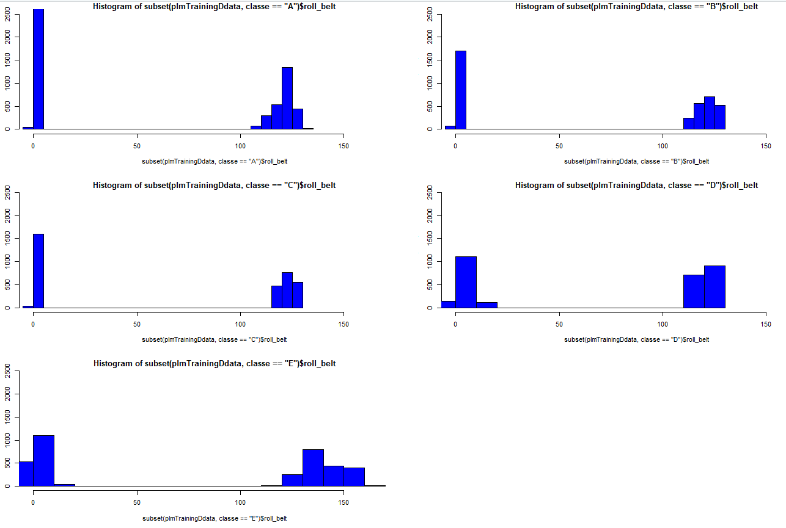
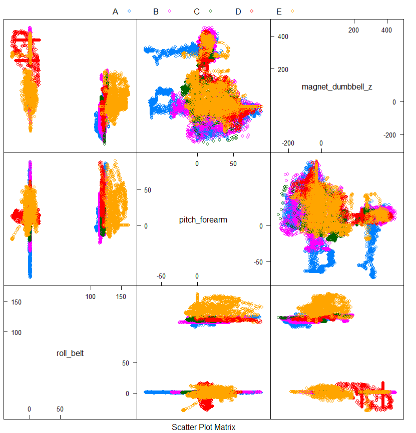
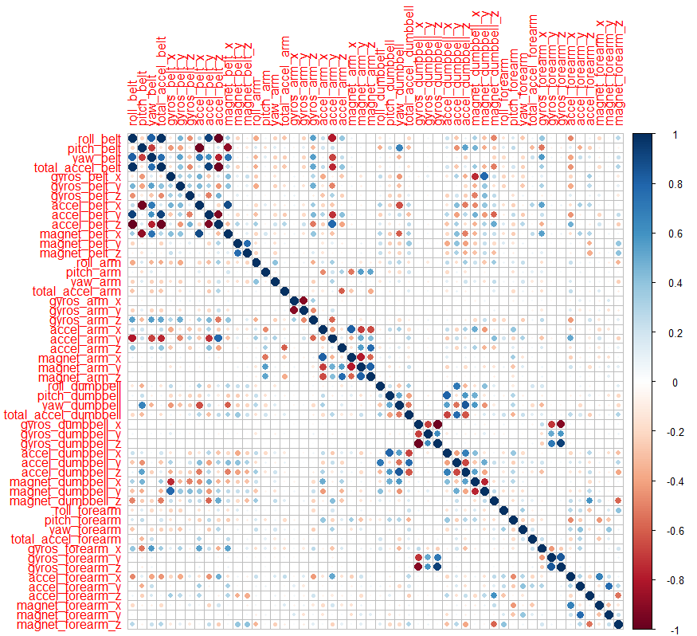
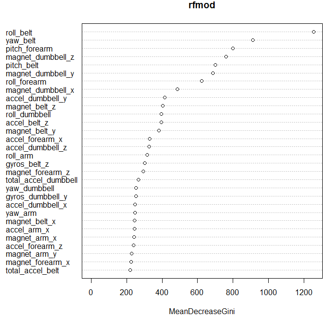
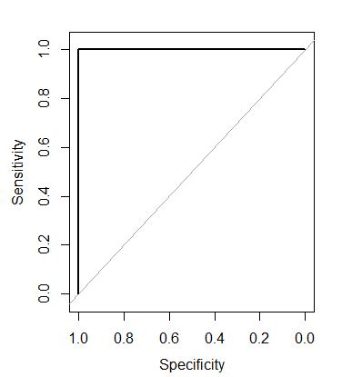

```{r setup, include=FALSE}
knitr::opts_chunk$set(echo = TRUE)
```


## Abstract

Fitness trackers are abundant today.  We track our activity but is this enough to ensure we will get the expected benefit of the activity?  This paper explores using Machine Learning (Random Forest Algorithm) to detect if an exercise is performed correctly or not.  The application for this type of intelligence are many, especially in the sports performance area.


## Introduction
In this age of “SMART” devices, people regularly quantify how much exercise they do, but they rarely quantify how well they actually performed that exercise. (i.e., did they maximize the expected benefit of that exercise by doing it correctly).


Using data from accelerometers on the belt, forearm, arm, and dumbbell of 6 participants, we will attempt to predict how well each person held to form and accurately completed the exercise.  For this experiment we will focus on a single exercise: Unilateral Dumbbell Biceps Curl.

Six participants were asked to perform one set of 10 repetitions of the Unilateral Dumbbell Biceps Curl in five different ways.  The five different ways represent the “classe”, which was added to the training dataset :

1.	Class A - exactly according to the specification 
2.	Class B - throwing the elbows to the front 
3.	Class C - lifting the dumbbell only halfway 
4.	Class D - lowering the dumbbell only halfway 
5.	Class E - throwing the hips to the front 


## Methods
In any machine learning algorithm, it is critical that cross-validation is performed.  The approach taken was to split the training data from the testing data.   The training data provided the correct “classe” indicating proper form or otherwise.  The testing data was not used until the model was created based on the training data.


To form our hypothesis, we first studied the problem domain to understand how the human body moves during correctly performed unilateral dumbbell bicep curls.   We then made some predictions for sensor readings based on the four incorrectly performed classes.


*	Class B – throwing elbows forward - should see arm sensor anomaly – more movement than in Class A.
*	Class C – lift dumbbell only half way  - should see forearm sensor anemonol- only see ½ has much movement as in Class A
*	Class D – lowering the dumbbell only ½ way - should see forearm sensor anomaly – only see ½ as much movement as in Class A
*	Class E – throwing hips forward - should see belt sensor anomaly – should see forward movement where little or no movement should be seen in Class A.


Next, we performed exploratory data analysis on the provided training dataset to uncover insights and assess which features may help us to achieve our goal distinguishing between well-performed vs ill-performed repetitions.   

  


  


Finally, we selected the Random Forest Machine Learning Algorithm due to its ability to avoid overfitting and created our model using the R programming language.  Below are the steps used for build our model:

1.	Setup environment – load R libraries, set working directly, set a seed for reproducibility of this work
2.	Loaded the Training and Testing data to create R data frames
3.	Cleaned the data (from findings of exploratory data analysis) – created factor variable for “classe”, removed columns with NA values, removed non-numeric columns.
4.	Assessed the remaining variables to determine correlation.  Created correlation matrix and plot
5.	Created a Random Forest model from the training data
6.	Validated the “Importance” of the features selected
7.	Made predictions on the Testing data using the model
8.	Assessed the results of the model’s accuracy using ROC/AUC


The training data for this project are available here:
https://d396qusza40orc.cloudfront.net/predmachlearn/pml-training.csv  

The test data are available here:
https://d396qusza40orc.cloudfront.net/predmachlearn/pml-testing.csv


## Results


The Correlation Matric (fig XX) indicated several variables (positive and negative) with high correlation.  The correlation is highly consistent with our hypothesis predicting the belt, forearm, and dumbbell should show incorrect exercise form.


`cor(plmTrainingDdata$accel_belt_y, plmTrainingDdata$roll_belt)          `  
`[1] 0.9248983                                                           `    
`cor(plmTrainingDdata$accel_belt_z, plmTrainingDdata$roll_belt)          `  
`[1] -0.9920085                                                          `  
`cor(plmTrainingDdata$total_accel_belt, plmTrainingDdata$roll_belt)      `  
`[1] 0.9809241                                                           `  
`cor(plmTrainingDdata$total_accel_belt, plmTrainingDdata$accel_belt_z)   `  
`[1] -0.9749317                                                          `  
`cor(plmTrainingDdata$gyros_forearm_z, plmTrainingDdata$gyros_dumbbell_z)`  
`[1] 0.9330422                                                           `  
`cor(plmTrainingDdata$gyros_forearm_z, plmTrainingDdata$gyros_dumbbell_x)`  
`[1] -0.9144764                                                          `  


  


After running the Random Forrest algorithm on the training data, we can see that the expected out of sample error is 0.3% which is very good (close to zero).   The forest consisted of 1000 trees with 7 variables used at each split.   The Confusion Matrix below provides the error class percentage for each of the 5 exercise classes.


`Call:`  
` randomForest(formula = classe ~ ., data = plmTrainingDdata, ntree = 1000) `  
`               Type of random forest: classification`  
`                     Number of trees: 1000`  
`No. of variables tried at each split: 7`  

`        OOB estimate of  error rate: 0.28%`  
`Confusion matrix:`  
`     A    B    C    D    E  class.error`  
`A 5578    1    0    0    1 0.0003584229`  
`B    9 3785    3    0    0 0.0031603898`  
`C    0   11 3410    1    0 0.0035067212`  
`D    0    0   21 3193    2 0.0071517413`  
`E    0    0    1    4 3602 0.0013861935`  


Next, we validated the “Importance” of the features selected by the Random Forest algorithm.   See Figure (XXX)   

 

We then made predictions on the Testing data using the model.   Below you can see we predicted 20 different test cases: 
`> predWithProbs`  
`       A     B     C     D     E`  
`1  0.053 0.844 0.084 0.012 0.007`  
`2  0.966 0.017 0.011 0.000 0.006`  
`3  0.102 0.722 0.111 0.011 0.054`  
`4  0.934 0.005 0.032 0.026 0.003`  
`5  0.967 0.012 0.016 0.002 0.003`  
`6  0.009 0.078 0.067 0.025 0.821`  
`7  0.008 0.003 0.065 0.908 0.016`  
`8  0.048 0.764 0.069 0.094 0.025`  
`9  1.000 0.000 0.000 0.000 0.000`  
`10 0.987 0.012 0.000 0.001 0.000`  
`11 0.048 0.806 0.060 0.052 0.034`  
`12 0.016 0.047 0.872 0.019 0.046`  
`13 0.002 0.987 0.002 0.002 0.007`  
`14 1.000 0.000 0.000 0.000 0.000`  
`15 0.005 0.020 0.014 0.021 0.940`  
`16 0.008 0.030 0.003 0.011 0.948`  
`17 0.978 0.000 0.000 0.000 0.022`  
`18 0.038 0.894 0.009 0.048 0.011`  
`19 0.080 0.893 0.008 0.013 0.006`  
`20 0.001 0.994 0.003 0.000 0.002`  
`attr(,"class")`  
`[1] "matrix" "votes"`    

`> predWithClass`  
` 1  2  3  4  5  6  7  8  9 10 11 12 13 14 15 16 17 18 19 20 `  
` B  A  B  A  A  E  D  B  A  A  B  C  B  A  E  E  A  B  B  B `  
`Levels: A B C D E`  


Finally, we assessed the final results of the model’s accuracy using ROC/AUC metrics.  


 

The Random Forrest Algorithm performed excellent for this type of machine learning problem.  In the end, all 20 predictions were correct.   

## Discussion

The Random Forrest Algorithm was a good choice for this machine learning use case.  All 20 classes were predicted correctly!  We could have used other methods such as Linear Regression or Decision Trees.  It would be interesting to try these methods and compare them to the performance of Random Forest.  

In this paper we have shown that doing exploratory data analysis is useful to understand the data set you are working with to help augment or formulate your hypothesis before any training or model creation takes place.   This is a critical step that should be considered.  

## Acknowledgments and Citations
[1] Velloso, E.; Bulling, A.; Gellersen, H.; Ugulino, W.; Fuks, H. Qualitative Activity Recognition of Weight Lifting Exercises. Proceedings of 4th International Conference in Cooperation with SIGCHI (Augmented Human '13) . Stuttgart, Germany: ACM SIGCHI, 2013.  

More information is available from the website here: http://web.archive.org/web/20161224072740/http:/groupware.les.inf.puc-rio.br/har (see the section on the Weight Lifting Exercise Dataset).  

[2] I would like to thank the instructors for preparing such a comprehensive course on practical machine learning:  

*	Jeff Leek, PhD; Associate Professor, Biostatistics ;Bloomberg School of Public Health 
*	Roger D. Peng, PhD; Associate Professor, Biostatistics; Bloomberg School of Public Health
*	Brian Caffo, PhD; Professor, Biostatistics; Bloomberg School of Public Health

